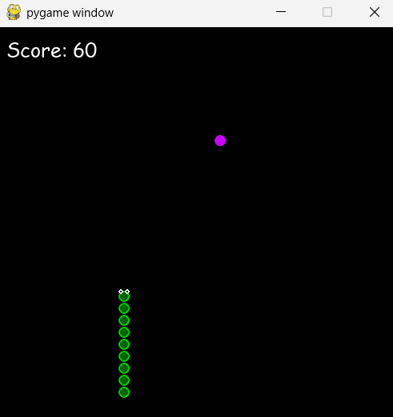
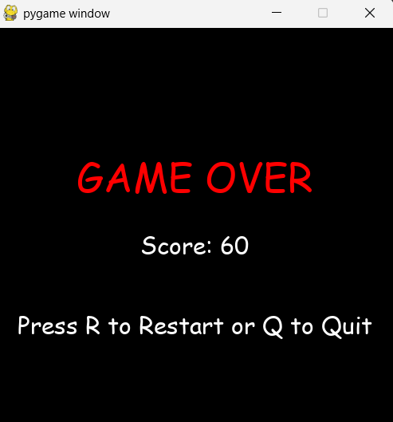

# Інструкція до гри "Змійка"

## Зміст
1. [Запуск гри](#запуск-гри)
2. [Головне меню](#головне-меню)
3. [Ігровий процес](#ігровий-процес)
4. [Система підрахунку очок](#система-підрахунку-очок)
5. [Завершення гри](#завершення-гри)

## Запуск гри

### Крок 1: Перевірка встановлення Python
Переконайтеся, що у вас встановлений Python версії 3.7 або новішої:
```bash
python --version
```

### Крок 2: Запуск
Запустіть файл гри:
```bash
python snake_game.py
```

## Головне меню

При запуску гри ви побачите головне меню.


### Процес гри

Після натискання будь-якої клавіши на клавіатурі гра починається.



### Закінчення гри

Після завершення гри ви побачите екран Game Over.



**Дії:**
- Натисніть будь-яку клавішу на клавіатурі, щоб почати гру
- Натисніть хрестик на вікні або ESC, щоб вийти

## Ігровий процес

### Початок гри
Після натискання клавіші в меню гра одразу починається:
- Змійка складається з 3 сегментів
- Змійка починає рухатись вправо
- На полі з'являється перше яблуко

### Керування змійкою

Ви можете обрати один з двох варіантів керування:

**Варіант 1: Стрілки**
- ↑ (Стрілка вгору) - рух вгору
- ↓ (Стрілка вниз) - рух вниз
- ← (Стрілка вліво) - рух вліво
- → (Стрілка вправо) - рух вправо

**Варіант 2: WASD**
- W - рух вгору
- S - рух вниз
- A - рух вліво
- D - рух вправо

**Важливо:**
- Змійка НЕ може повертати в протилежний бік миттєво (наприклад, якщо рухається вправо, не може одразу повернути вліво)
- Змійка постійно рухається - зупинити її неможливо

### Візуальні елементи

**Змійка:**
- Складається з кругових сегментів зеленого кольору
- Голова має очі, які дивляться в напрямку руху
- Кожен сегмент має два кола: зовнішнє та внутрішнє

**Яблука:**
- Мають яскраві неонові кольори (рожевий, зелений, блакитний, жовтий, помаранчевий...)
- З'являються у випадкових місцях на ігровому полі
- Кожне яблуко має унікальний колір

**Рахунок:**
- Відображається у верхньому лівому куті екрану
- Формат: "Score: X"
- Оновлюється після кожного з'їденого яблука

### Як грати

1. **Їжте яблука**
   - Наведіть голову змійки на яблуко
   - Коли змійка з'їдає яблуко, вона стає довшою на один сегмент
   - Ви отримуєте 10 очок
   - З'являється нове яблуко в іншому місці

2. **Уникайте перешкод**
   - Не врізайтеся в межі ігрового поля
   - Не врізайтеся в тіло змійки вона буде зменшуватися

3. **Збирайте очки**
   - Чим більше яблук з'їсте, тим більше очок наберете
   - Чим довша змійка, тим складніше грати

## Система підрахунку очок

- **Початкові очки:** 0
- **За кожне яблуко:** +10 очок
- **Максимальний рахунок:** обмежується розміром поля

## Завершення гри

### Умови Game Over

Гра закінчується в одному з випадків:

1. **Зіткнення зі стіною**
   - Змійка виїхала за межі ігрового поля (вгору, вниз, вліво або вправо)

2. **Самопоїдання**
   - Голова змійки врізалася в будь-який сегмент її власного тіла

### Екран Game Over

Після завершення гри ви побачите:
- Напис "GAME OVER" червоним кольором
- Ваш фінальний рахунок: "Score: X"
- Інструкції для подальших дій:
  - "Press R to Restart" - натисніть R, щоб почати нову гру
  - "or Q to Quit" - натисніть Q, щоб вийти з гри

**Можливі дії:**
- **R** - перезапускає гру (повертає до головного меню)
- **Q** - закриває програму повністю
- **Хрестик на вікні** - теж закриває програму

### Екран перемоги (WIN)
Якщо вам вдасться заповнити все ігрове поле (з'їсти всі можливі яблука):
- З'явиться напис "WIN" зеленим кольором
- Через 4 секунди гра автоматично закриється

## Технічні деталі

### Розмір вікна
- **Ширина:** 500 пікселів
- **Висота:** 500 пікселів

### Швидкість гри
- **FPS:** 60 кадрів за секунду
- **Швидкість руху:** Змійка рухається кожні 10 кадрів
- Це означає, що змійка робить рух приблизно 6 разів на секунду

### Розмір сегментів
- **Розмір одного сегмента:** 15×15 пікселів
- **Ігрове поле:** 33×33 клітинки

### Кольори
- **Змійка:** Зелені відтінки (RGB: 0, 200, 0 та 0, 100, 0)
- **Яблука:** 10 різних неонових кольорів
- **Фон:** Чорний (RGB: 0, 0, 0)

## Підтримка

Якщо виникли проблеми з запуском або грою:

1. Переконайтеся, що встановлено Python 3.7+
2. Переконайтеся, що встановлено Pygame
3. Перевірте, чи файл `snake_game.py` не пошкоджений
4. Спробуйте перезавантажити комп'ютер

---

**Приємної гри!**